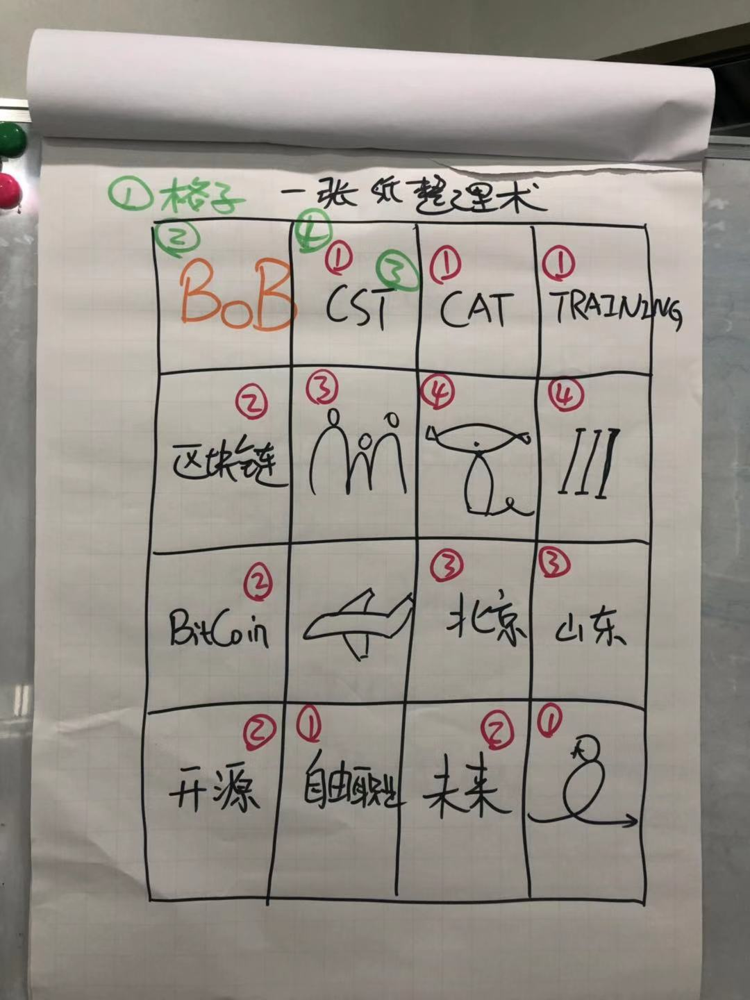
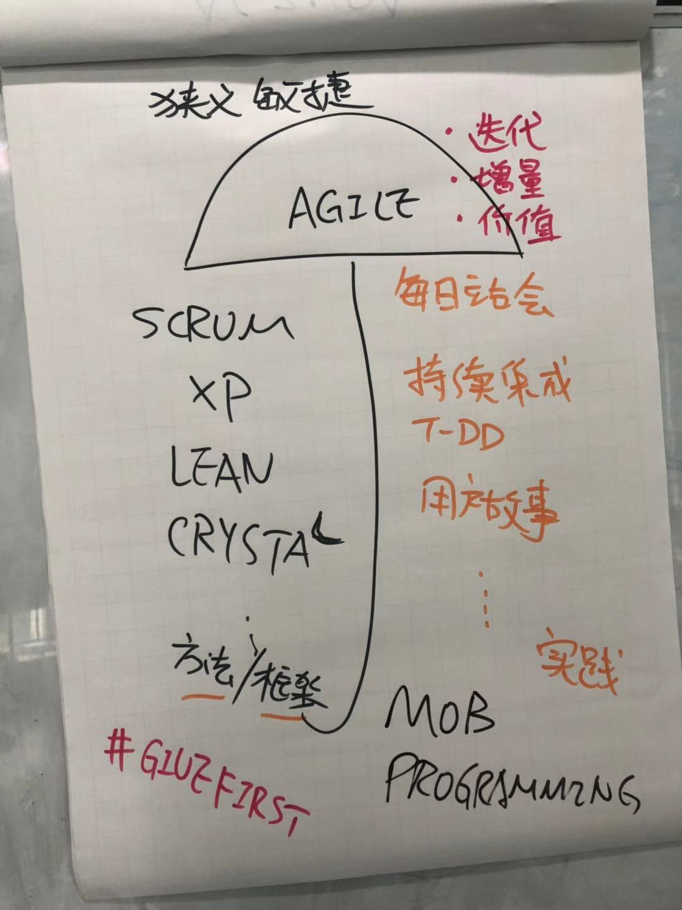
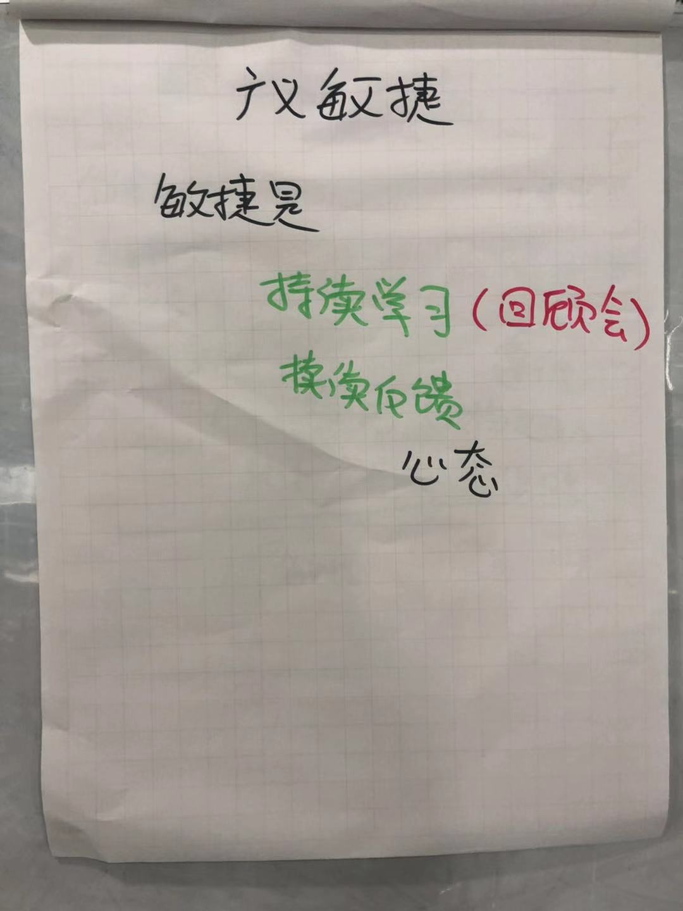
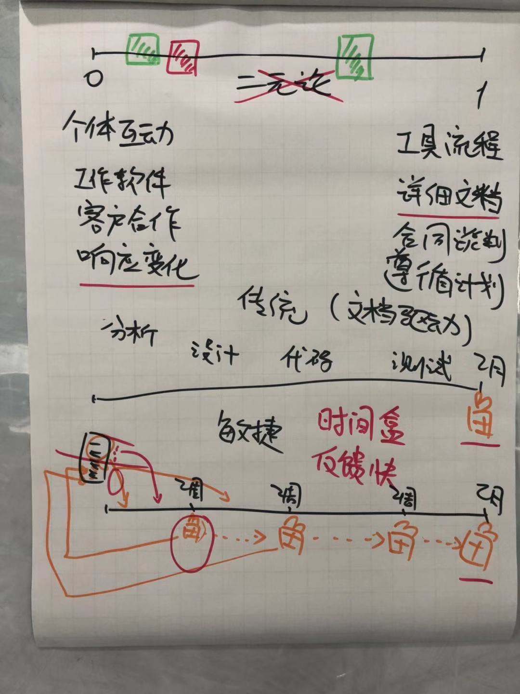
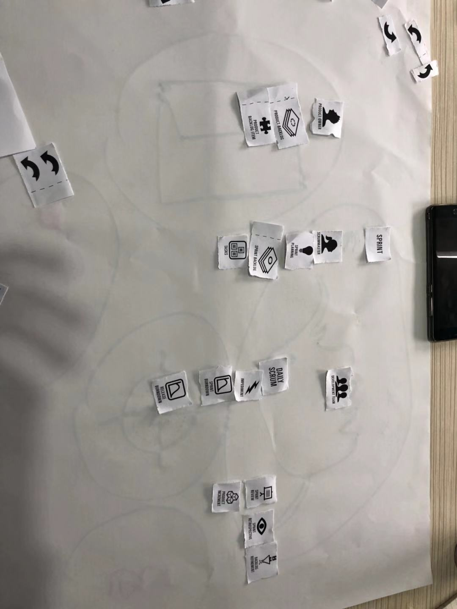
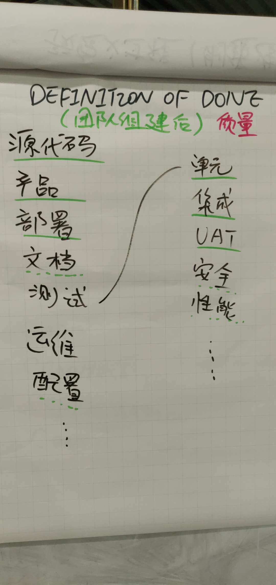
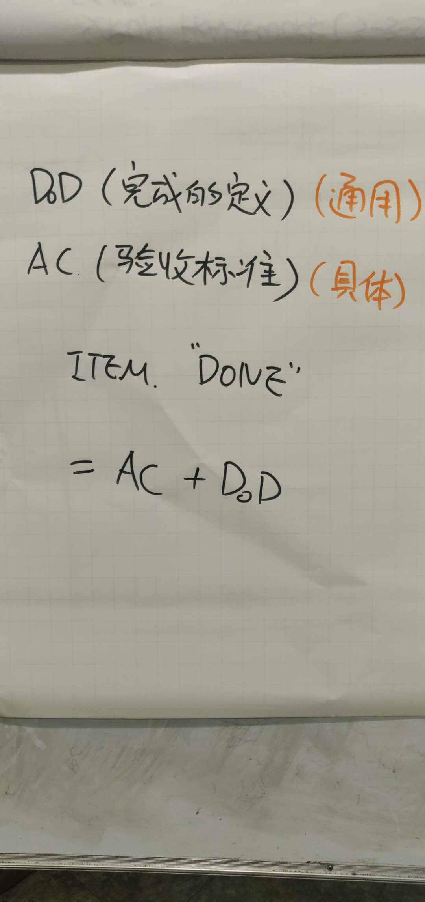
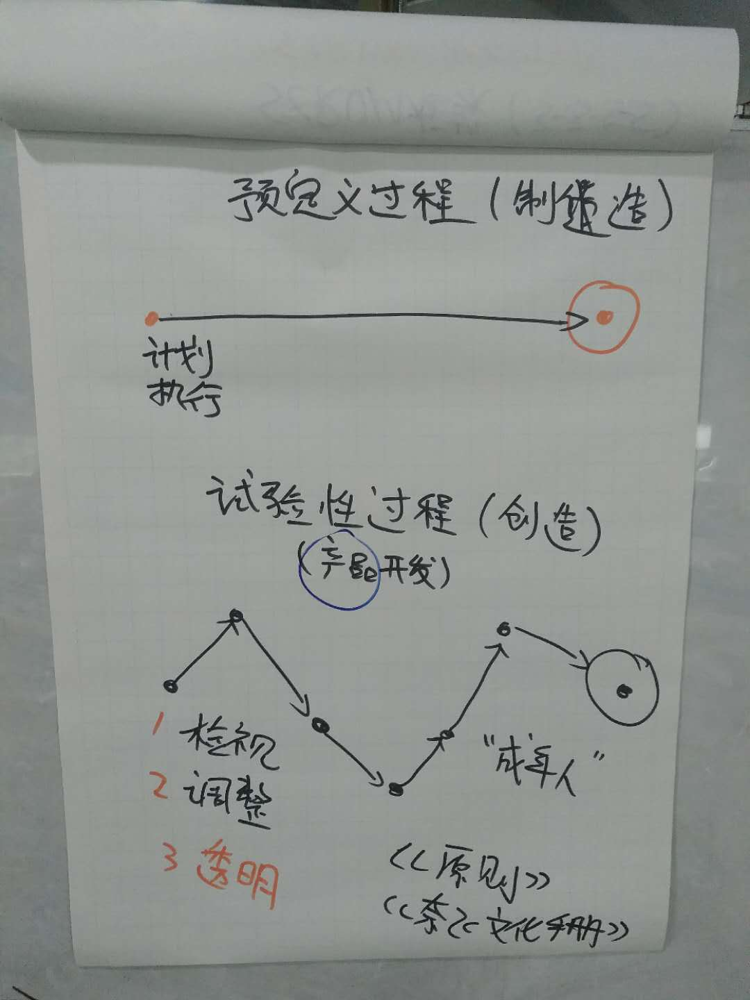
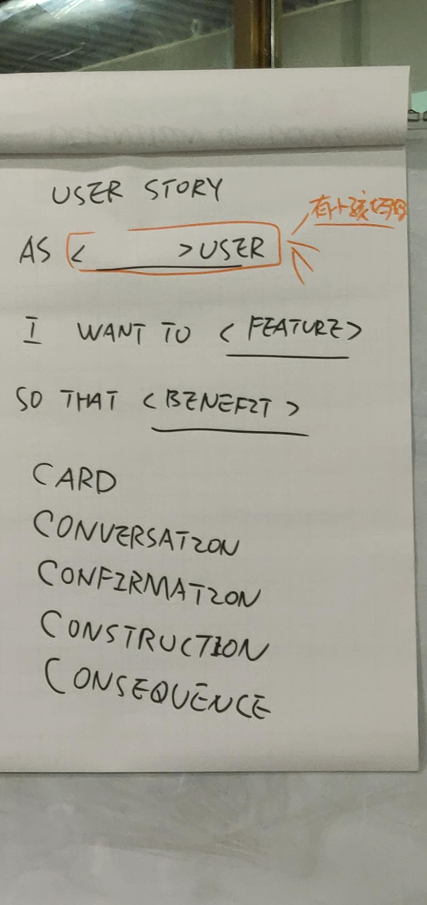
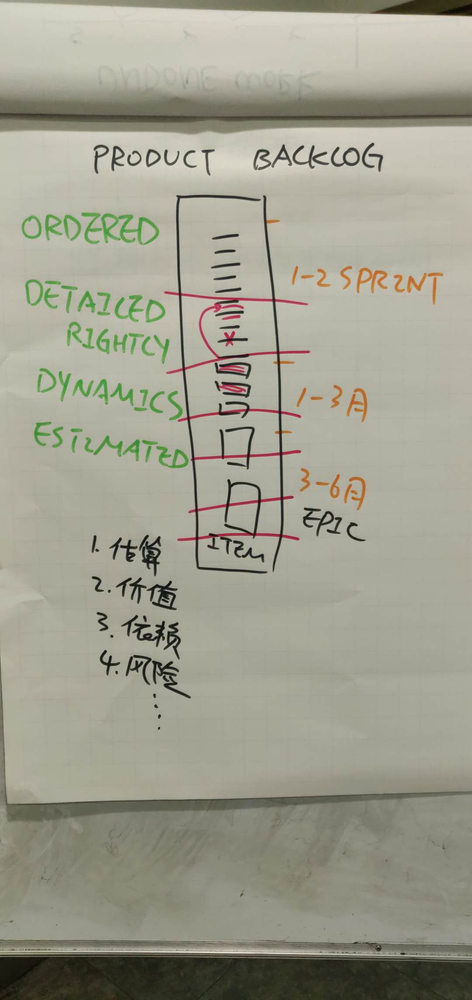

# 两种思维
对孩子做的实验。
## 过程思维
 * 注重过程。
 * 认为人的能力是可以成长。
 * 要离开舒适区，勇敢挑战未知的领域
## 结果思维  
 * 注重结果。
---
 # 一张纸整理术  

适用于演讲、自我介绍 和 每天的工作安排。
 1.将一张A4纸分割成十六格：  
 2.在第一格标记主题。  
 3.在其余的格子里填标签。  
 4.给标签分类。  
 
 ---
# 敏捷思维
  
 ---
 #  敏捷宣言
>**个体和互动** 高于 流程和工具  
**工作的软件** 高于 详尽的文档  
**客户合作** 高于 合同谈判  
**响应变化** 高于 遵循计划  

 
 ---
 # 翻雪花游戏
 规则：  
 1.只能用左手翻  
 2.每个雪花要翻队员人数次  

 ## 1.传统
 每人轮流把所有雪花翻一次，然后传递给下一个人。

 ## 2.传统+流水
 每人翻一枚雪花后，立马传递给下一个人。

 ## 3.Scrum+拆分
 每人分到若干雪花，然后同时开始翻。

Feature Team
高内聚低耦合

此处有画图小游戏

---
# Scrum 3-3-5-5理论
## 3个角色  
 * 产品负责人（Product Owner）  
 * Scrum Master  
 * Scrum团队  
## 3个工件  
 * 产品Backlog（Product Backlog）  
 * SprintBacklog  
 * 燃尽图（Burn-down Chart)  
## 5个活动  
 * Sprint计划会议（Sprint Planning Meeting）  
 * 每日站会（Daily Scrum Meeting）  
 * Sprint评审会议（Sprint Review Meeting）  
 * Sprint回顾会议（Sprint Retrospective Meeting）  
 * 产品Backlog梳理会议（ Product Backlog Refinement）  
## 5个价值  
 * 承诺 – 愿意对目标做出承诺  
 * 专注– 把你的心思和能力都用到你承诺的工作上去  
 * 开放– Scrum 把项目中的一切开放给每个人看  
 * 尊重– 每个人都有他独特的背景和经验  
 * 勇气– 有勇气做出承诺，履行承诺，接受别人的尊重  
---
# Scrum流程
 
 ---
# Definition Of Done

---
# 预定义过程VS实验性过程

---
# User Story

---
# Product backlog
