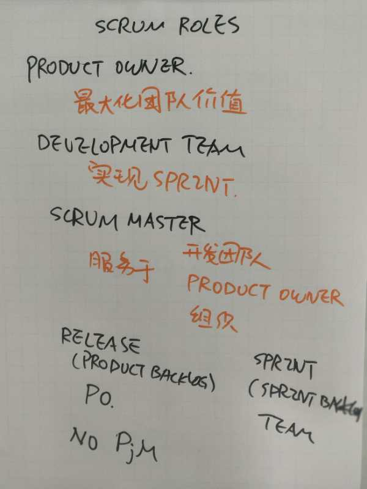
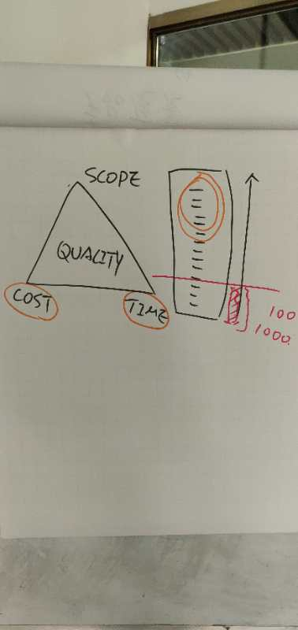
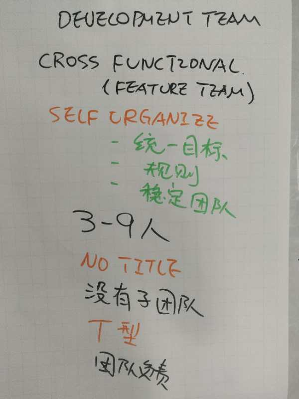
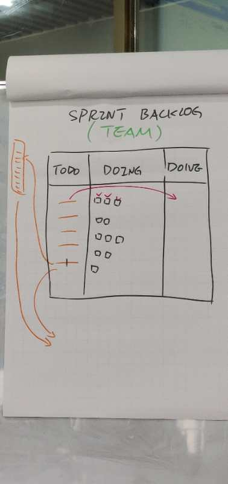
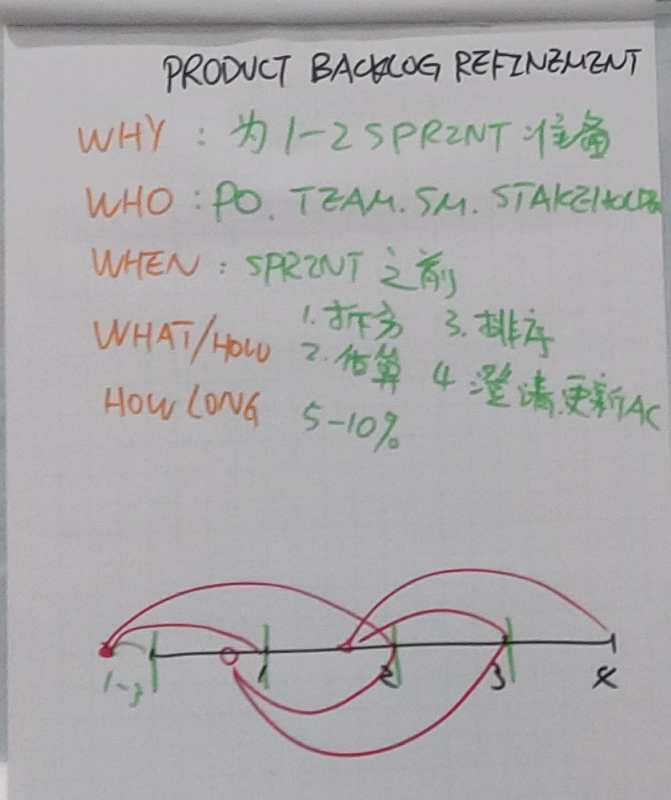
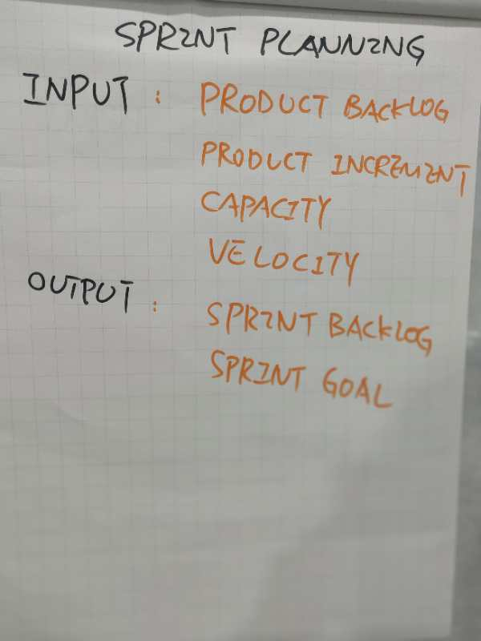
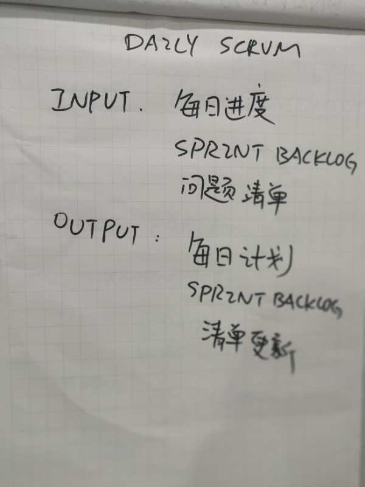
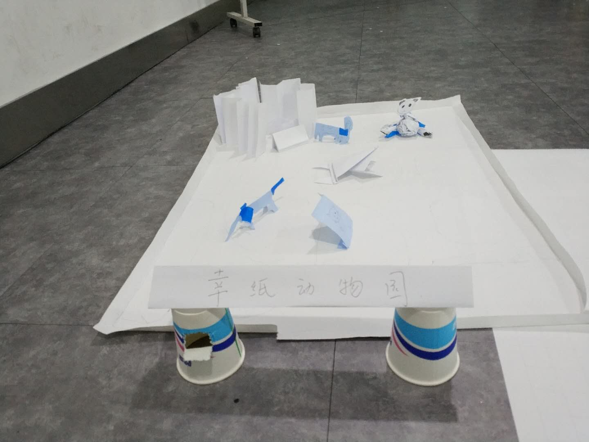

# 敏捷开发在家庭的应用
 
 ---
# product owner
 * 最大化团队价值（排序product backlog）

# development team
 * 实现sprint
  
# scrum master
 * 服务于团队
 * 服务于product owner
 * 服务于组织  
 
 

 # development team的特性
 

 ---
# sprint backlog
 
 ---
# product backlog refinement
 
 ---
# sprint planning
 
 ---
# daily scrum
 
 ---
# sprint review
 * input: 每日进度 sprint backlog 问题清单
 * output: 每日计划 sprintbacklog更新
---
# Retrospective(回顾会)
 * input：data actionPlan
 * ouput： actionPlan

---
# 动物园游戏:
要求：
 *  200+动物
 *  动物要站立
 *  纸质动物
 
 ---
 # Scrum 流程图
  
